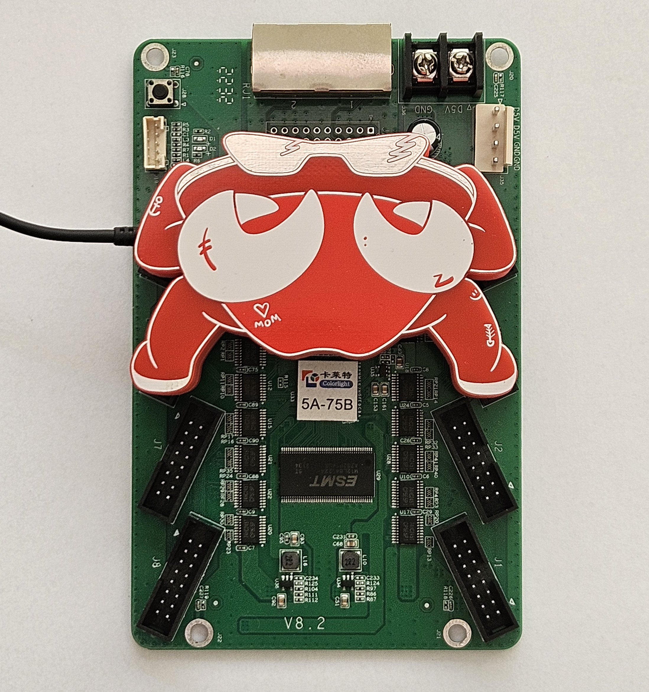

# Chubby Crab (Colorlight Programmer)
A project to make programming the Colorlight 5A-75B a plug-and-play situation. It is built around the Adafruit FT232H.  
This programmer only fits on Colorlight 5A-75B versions 8.x

This project is inspired by the [q3k/chubby75](https://github.com/q3k/chubby75) project.  
Placement of the components is taken from [cyber-murmel/chubby-hat](https://github.com/cyber-murmel/chubby-hat). Thank you for doing the work of mapping the exact placements.

# How to use
*Note: if you're looking for a quick and easy way to flash just a few Colorlights, you might as well just use a JTAG programmer and connect it as explained in the [chubby75 documentation](https://github.com/q3k/chubby75/tree/master/5a-75b).*

Connect the Chubby Crab to the Colorlight by placing the 4 connectors (arms and legs) on Colorlight connectors J3, J4, J5, J6. When placed correctly, the pogo pins will connect to the JTAG, 3.3V, GND pads on the Colorlight.
When powering the Colorlight via the Chubby Crab (USB), set the slide switch to 3.3V. When powering the Colorlight with external 5V, set the slide switch to NC (Not Connected).

# Make your own
This repo contains all files to make your own Chubby Crab. Follow the steps from `./instructions.md` and you should end up with your own crab.
For those that skip instruction files: J7 parts are not included in the BOM, order separately.

## Room for improvement
This was just my first prototype and since it does what it must do, I can't be bothered (yet) to make a V2. But there's (quite some) room for improvement. Please open issues for ideas for improvement. If the list grows big enough, I might make a V2.

# License
This project is released under the MIT license.
Note that a part of this project was taken from the [cyber-murmel/chubby-hat](https://github.com/cyber-murmel/chubby-hat) project under [MIT License](https://github.com/cyber-murmel/chubby-hat/blob/main/LICENSE).
