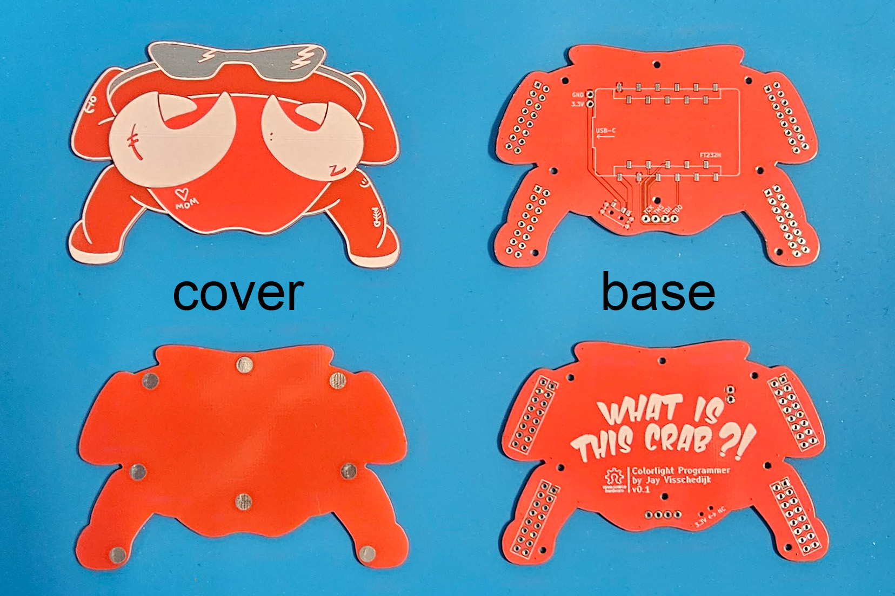

*Note: the PCB in the pictures shows the wrong JTAG pinout notation. This is fixed in V1.0*

# Order PCBs
Gerber files: `./pcb/{base,cover}/gerber`  
Bill of Material: `./pcb/{base,cover}/bom`  
Pick & Place file: `./pcb/{base,cover}/cpl`  

# Components
The two Bills of Material contain all components you need for one Chubby Crab.  
For hand soldering: Order those components on LCSC. Find all components quickly by uploading the Bill of Material in the search bar.  
For PCB Assembly: LCSC part numbers are listed for PCB assembly by JLCPCB. The only component I couldn't find on LCSC were 1x11P 2.54 female connectors, 5mm heigth and SMD, staggered pins. You need to order those separately. If you find those on LCSC, please let me know.  
The parts below should be ordered separately and are not included on the Bill of Material.  
You also need a USB-C cable. The cable should have a connector of ≤17mm long (excl. inserted part), or you need to adjust the strain relief part of the spacer. (Sorry! It's on the improvements list.)

| Part                                              | Qty | URL                                               |
| ------------------------------------------------- | --- | ------------------------------------------------- |
| Female Header, PH5, Single Row type 1 or 2, 1x11P | 2   | https://aliexpress.com/item/1005006319376319.html |
| Screws, M1.6 * 16mm                               | 8   | https://aliexpress.com/item/1005006674159703.html |
| Adafruit FT232H                                   | 1   | https://www.adafruit.com/product/2264             |

Instead of using 2x8P headers (C30734, J8-J11), I just cut 1x8 pieces from a long header strip.

# Hand-soldering PCBs
1. Solder the 2 connectors and slide switch on the frontside of the base PCB. [picture](./img/base-front.jpg)
2. Place the 4 mounting connectors on the backside of the base PCB. Two single rows will also suffice. [picture](./img/base-back.jpg)
3. Place the 6 pogo pins. When done, place the PCB on a Colorlight and see if the pogo pins touch the JTAG/3.3V/GND pins. If not, leave the PCB on the Colorlight, heat up the solder joint and adjust the pin until it is correct. [(same) picture](./img/base-back.jpg)
4. Place the 8 standoffs on the backside of the cover PCB, big side down. Try to place them *perfectly* in the center of the pad, since I left no room for adjustments. (Sorry! Again, it's on the list..) Try not to fill up the standoff with solder and block the way for the screws to be inserted. If you're using tweezers, realize that the tweezers absorb heat. Make sure to heat up the pad + standoffs before positioning it with the tweezers. [picture](./img/cover-back.jpg)

# Print spacer
STL files: `./spacer`

Best printed with a 0.2 nozzle.

# Assemble the Chubby Crab
1. Check if the switch cap fits on the slide switch. If not, adjust print or shape it with a knife until it fits. [picture](./img/switch-cap.jpg)
2. Check if the switch cap slides back and forth inside the spacer. If not, take the excess filament off with a knife until it slides. Especially the brim can cause friction.
3. Make sure the screws fit through the holes in the spacer. If not, drill them out.
4. Place the spacer + switch cap on the base PCB.
5. Connect the USB-C cable to the FT232H and place it in the sockets. Push the USB-C cable firmly into the spacer. [picture](./img/inside.jpg)
6. Place the cover on top and screw it closed. This is probably the moment you find out some of the standoffs are not aligned perfectly. Luckily, just a few screws are needed to keep everything together. If you get 2-4 screws in on strategic places, your crab will live. [picture](./img/assembled.jpg)